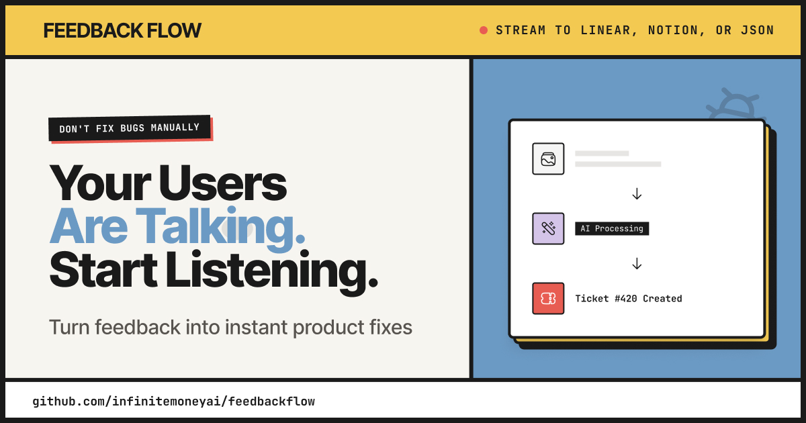

<div align="center">
  
  <h1>FeedbackFlow</h1>
  <p><strong>Open-source feedback management platform with AI-powered insights</strong></p>
  
  <p>
    <a href="#features"><strong>Features</strong></a> ·
    <a href="#quick-start"><strong>Quick Start</strong></a> ·
    <a href="#documentation"><strong>Documentation</strong></a> ·
    <a href="#contributing"><strong>Contributing</strong></a>
  </p>

  <p>
    <a href="https://github.com/infinitemoneyai/feedbackflow/blob/main/LICENSE">
      
    </a>
    <a href="https://github.com/infinitemoneyai/feedbackflow/stargazers">
      
    </a>
    <a href="https://github.com/infinitemoneyai/feedbackflow/issues">
      
    </a>
  </p>

  <p>
    <a href="https://vercel.com/new/clone?repository-url=https%3A%2F%2Fgithub.com%2Finfinitemoneyai%2Ffeedbackflow&env=NEXT_PUBLIC_CONVEX_URL,CONVEX_DEPLOYMENT,NEXT_PUBLIC_CLERK_PUBLISHABLE_KEY,CLERK_SECRET_KEY&envDescription=Required%20API%20keys%20for%20FeedbackFlow&envLink=https%3A%2F%2Fgithub.com%2Finfinitemoneyai%2Ffeedbackflow%23environment-variables&project-name=feedbackflow&repository-name=feedbackflow">
      
    </a>
    <a href="https://feedbackflow.cc">
      
    </a>
  </p>
</div>

---

## Overview

FeedbackFlow is a modern, open-source feedback management platform that helps teams collect, organize, and act on user feedback. Built with Next.js 15, Convex, and AI integrations, it offers a complete solution for managing feedback from capture to resolution.

### Why FeedbackFlow?

- 🎯 **Embeddable Widget**: Capture screenshots and screen recordings directly from your app
- 🤖 **AI-Powered**: Auto-categorize feedback, generate solution suggestions, and draft tickets
- 🔄 **Real-time**: Built on Convex for instant updates across your team
- 🎨 **Modern UI**: Retro-inspired design with smooth animations and responsive layouts
- 🔌 **Integrations**: Export to Linear, Notion, or via webhooks and REST API
- 🔐 **Secure**: Encrypted API key storage, GDPR-compliant data handling
- 📊 **Analytics**: Track feedback trends, response times, and team performance
- 🎫 **Automation**: Rule-based automation for status changes, assignments, and notifications

## Features

### Core Features

- **Embeddable Feedback Widget**
  - Screenshot capture with annotation tools
  - Screen recording with audio (optional)
  - Offline queue with automatic retry
  - Customizable appearance and positioning
  - Honeypot spam protection

- **AI Integration**
  - Auto-categorization (bug, feature, question)
  - Solution suggestions based on similar feedback
  - Ticket drafting for Linear/Notion
  - Conversational AI assistant
  - Bring your own API keys (OpenAI or Anthropic)

- **Team Collaboration**
  - Real-time updates and notifications
  - Comments and internal notes
  - @mentions and assignments
  - Status tracking and workflows
  - Team management with role-based access

- **Integrations**
  - Linear: Create issues directly from feedback
  - Notion: Export to databases with custom properties
  - Webhooks: Real-time event notifications
  - REST API: Full programmatic access
  - JSON Export: Bulk export with custom templates

- **Advanced Features**
  - Automation rules with conditions and actions
  - Custom fields and metadata
  - Submitter portal for follow-ups
  - Email notifications via Resend
  - Hybrid storage (Convex + S3/R2/GCS)
  - GDPR data export and deletion

## Tech Stack

- **Frontend**: Next.js 15 (App Router), React 19, TypeScript
- **Backend**: Convex (serverless, real-time)
- **Auth**: Clerk (with team management)
- **Payments**: Stripe (seat-based pricing)
- **AI**: OpenAI / Anthropic (user-provided keys)
- **Email**: Resend
- **Storage**: Convex + optional S3/R2/GCS
- **UI**: Tailwind CSS, shadcn/ui
- **Testing**: Vitest, Playwright

## Quick Start

### Prerequisites

- Node.js 18+ and npm
- A [Convex](https://convex.dev) account (free tier available)
- A [Clerk](https://clerk.com) account (free tier available)

### Installation

1. **Clone the repository**

```bash
git clone https://github.com/infinitemoneyai/feedbackflow.git
cd feedbackflow
```

2. **Install dependencies**

```bash
npm install
```

3. **Set up environment variables**

Copy `.env.example` to `.env.local` and fill in your credentials:

```bash
cp .env.example .env.local
```

Required variables:
- `CONVEX_DEPLOYMENT` and `NEXT_PUBLIC_CONVEX_URL` (from Convex dashboard)
- `NEXT_PUBLIC_CLERK_PUBLISHABLE_KEY` and `CLERK_SECRET_KEY` (from Clerk dashboard)
- `STRIPE_SECRET_KEY` and `NEXT_PUBLIC_STRIPE_PUBLISHABLE_KEY` (optional for development)
- `RESEND_API_KEY` (optional for development)

4. **Initialize Convex**

```bash
npx convex dev
```

This will create a new Convex project and push the schema.

5. **Run the development server**

```bash
npm run dev
```

Visit [http://localhost:3000](http://localhost:3000) to see the app.

6. **Build the widget**

```bash
npm run widget:build
```

The widget will be available at `/widget.js` for embedding.

### Embedding the Widget

Add this snippet to your website:

```html
<script src="https://your-domain.com/widget.js"></script>
<script>
  FeedbackFlow.init({
    widgetKey: "your-widget-key",
    position: "bottom-right"
  });
</script>
```

## Documentation

- [Self-Hosting Guide](SELF_HOSTING.md) - Configuration for self-hosted deployments
- [Convex Security Guide](CONVEX_SECURITY.md) - Security architecture and best practices
- [Pre-Launch Security Checklist](PRE_LAUNCH_SECURITY_CHECKLIST.md) - Complete before going public

### Project Structure

```
feedbackflow/
├── app/                    # Next.js App Router
│   ├── (auth)/            # Protected routes (dashboard, settings)
│   ├── (public)/          # Public routes (docs, pricing)
│   ├── api/               # API routes
│   └── onboarding/        # Onboarding flow
├── components/            # React components
├── convex/                # Convex backend functions
├── lib/                   # Utilities and integrations
├── widget/                # Embeddable widget source
├── __tests__/             # Unit tests (Vitest)
└── e2e/                   # E2E tests (Playwright)
```

### Key Commands

```bash
# Development
npm run dev              # Start dev server
npm run widget:dev       # Watch widget changes

# Building
npm run build            # Build for production
npm run widget:build     # Build widget

# Testing
npm run test             # Run unit tests
npm run test:watch       # Watch mode
npm run test:e2e         # Run E2E tests
npm run test:e2e:ui      # E2E tests with UI

# Code Quality
npm run lint             # Lint code
npm run typecheck        # Type check
```

### Environment Variables

See [`.env.example`](.env.example) for a complete list of environment variables.

### Database Schema

The Convex schema includes:
- `users`: User profiles and onboarding state
- `teams`: Team/organization data
- `subscriptions`: Stripe subscription tracking
- `projects`: Feedback projects
- `widgets`: Widget configurations
- `feedback`: User feedback entries
- `comments`: Internal team comments
- `notifications`: User notifications
- `automationRules`: Automation rules
- `integrations`: Third-party integrations (Linear, Notion)
- `webhooks`: Webhook configurations
- `exportTemplates`: Custom export templates

### API Documentation

FeedbackFlow provides a REST API for programmatic access. See the [API documentation](http://localhost:3000/docs/api) for details.

## Deployment

### Deploy to Vercel (Recommended)

[](https://vercel.com/new/clone?repository-url=https%3A%2F%2Fgithub.com%2Finfinitemoneyai%2Ffeedbackflow&env=NEXT_PUBLIC_CONVEX_URL,CONVEX_DEPLOYMENT,NEXT_PUBLIC_CLERK_PUBLISHABLE_KEY,CLERK_SECRET_KEY&envDescription=Required%20API%20keys%20for%20FeedbackFlow&envLink=https%3A%2F%2Fgithub.com%2Finfinitemoneyai%2Ffeedbackflow%23environment-variables&project-name=feedbackflow&repository-name=feedbackflow)

1. Click the button above
2. Vercel will prompt you for the required environment variables
3. Get your keys from [Convex](https://dashboard.convex.dev) and [Clerk](https://dashboard.clerk.com)
4. Deploy!

### Self-Hosting

FeedbackFlow can be self-hosted on any platform that supports Next.js. For detailed self-hosting instructions, including configuration of hardcoded URLs and widget setup, see [SELF_HOSTING.md](SELF_HOSTING.md).

Quick steps:

1. Build the application: `npm run build`
2. Start the server: `npm start`
3. Configure environment variables (see `.env.example`)
4. Set up Convex backend
5. Configure Clerk authentication
6. (Optional) Set up Stripe for billing

**Important:** Set `NEXT_PUBLIC_APP_URL` to your production domain and configure widget `apiUrl` to point to your instance.

See [CONTRIBUTING.md](CONTRIBUTING.md) for detailed setup instructions.

## Contributing

We welcome contributions! Please see our [Contributing Guide](CONTRIBUTING.md) for details.

### Development Workflow

1. Fork the repository
2. Create a feature branch: `git checkout -b feature/my-feature`
3. Make your changes
4. Run tests: `npm run test && npm run test:e2e`
5. Commit: `git commit -m "feat: add my feature"`
6. Push: `git push origin feature/my-feature`
7. Open a Pull Request

### Code Style

- Files: `kebab-case.tsx`
- Components: `PascalCase`
- Functions: `camelCase`
- Constants: `SCREAMING_SNAKE_CASE`

Run `npm run lint` to check code style.

## Community & Support

- 🐛 [Report a bug](https://github.com/infinitemoneyai/feedbackflow/issues/new?labels=bug)
- 💡 [Request a feature](https://github.com/infinitemoneyai/feedbackflow/issues/new?labels=enhancement)
- 💬 [Join our Discord](https://discord.gg/2sTEE3wceB)
- 📧 [Email us](mailto:hello@yourdomain.com)

## Security

See [SECURITY.md](SECURITY.md) for our security policy and how to report vulnerabilities.

## License

FeedbackFlow is open-source software licensed under the [GNU Affero General Public License v3.0 (AGPL-3.0)](LICENSE).

## Acknowledgments

Built with amazing open-source tools:
- [Next.js](https://nextjs.org) - React framework
- [Convex](https://convex.dev) - Backend and database
- [Clerk](https://clerk.com) - Authentication
- [Stripe](https://stripe.com) - Payments
- [Tailwind CSS](https://tailwindcss.com) - Styling
- [shadcn/ui](https://ui.shadcn.com) - UI components

---

<div align="center">
  <p>Made with ❤️ by the FeedbackFlow team</p>
  <p>
    <a href="https://github.com/infinitemoneyai/feedbackflow">GitHub</a> ·
    <a href="https://yourdomain.com">Website</a> ·
    <a href="https://twitter.com/feedbackflow">Twitter</a>
  </p>
</div>
